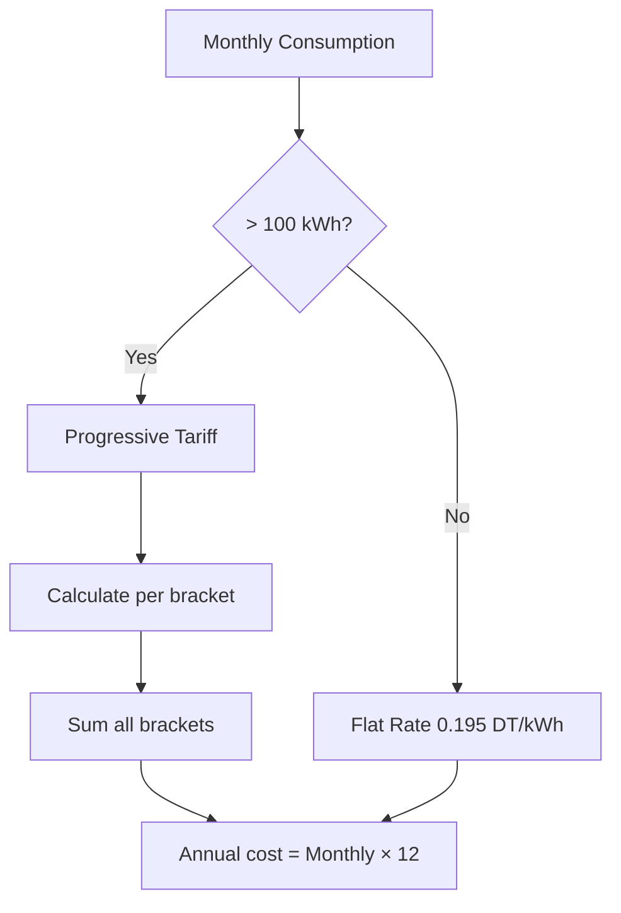

# Progressive Tariff System Guide

## Overview

JOYA now uses **STEG's progressive tariff structure** for calculating electricity costs, providing more accurate billing simulations for non-residential buildings consuming over 100 kWh/month.

---

## What is Progressive Tariff?

Progressive (or tiered) pricing charges different rates for different consumption levels. Like income tax brackets, you pay a lower rate for initial consumption and higher rates as consumption increases.

### STEG Non-résidentiel BT Tariff Structure

| Bracket | Monthly Consumption | Rate (DT/kWh) | Description |
|---------|---------------------|---------------|-------------|
| 1 | 0 - 200 kWh | 0.195 | Base rate |
| 2 | 200 - 300 kWh | 0.240 | Moderate usage |
| 3 | 300 - 500 kWh | 0.333 | High usage |
| 4 | 500+ kWh | 0.391 | Very high usage |

---

## Calculation Examples

### Example 1: Small Business (150 kWh/month)

**All consumption is in Bracket 1:**

```
150 kWh × 0.195 = 29.25 DT/month
Annual cost = 29.25 × 12 = 351.00 DT/year
Effective rate = 0.195 DT/kWh
```

**Bracket breakdown:**
- Bracket 1 (0-200): 150 kWh → 29.25 DT ✓
- Bracket 2 (200-300): 0 kWh → 0.00 DT
- Bracket 3 (300-500): 0 kWh → 0.00 DT
- Bracket 4 (500+): 0 kWh → 0.00 DT

---

### Example 2: Medium Business (250 kWh/month)

**Consumption spans 2 brackets:**

```
First 200 kWh × 0.195 = 39.00 DT
Next  50 kWh × 0.240 = 12.00 DT
────────────────────────────────
Total = 51.00 DT/month
Annual cost = 51.00 × 12 = 612.00 DT/year
Effective rate = 51.00 / 250 = 0.204 DT/kWh
```

**Bracket breakdown:**
- Bracket 1 (0-200): 200 kWh → 39.00 DT ✓
- Bracket 2 (200-300): 50 kWh → 12.00 DT ✓
- Bracket 3 (300-500): 0 kWh → 0.00 DT
- Bracket 4 (500+): 0 kWh → 0.00 DT

---

### Example 3: Large Business (400 kWh/month)

**Consumption spans 3 brackets:**

```
First 200 kWh × 0.195 = 39.00 DT
Next 100 kWh × 0.240 = 24.00 DT
Next 100 kWh × 0.333 = 33.30 DT
────────────────────────────────
Total = 96.30 DT/month
Annual cost = 96.30 × 12 = 1,155.60 DT/year
Effective rate = 96.30 / 400 = 0.2408 DT/kWh
```

**Bracket breakdown:**
- Bracket 1 (0-200): 200 kWh → 39.00 DT ✓
- Bracket 2 (200-300): 100 kWh → 24.00 DT ✓
- Bracket 3 (300-500): 100 kWh → 33.30 DT ✓
- Bracket 4 (500+): 0 kWh → 0.00 DT

---

### Example 4: Very Large Business (600 kWh/month)

**Consumption spans all 4 brackets:**

```
First 200 kWh × 0.195 = 39.00 DT
Next 100 kWh × 0.240 = 24.00 DT
Next 200 kWh × 0.333 = 66.60 DT
Next 100 kWh × 0.391 = 39.10 DT
────────────────────────────────
Total = 168.70 DT/month
Annual cost = 168.70 × 12 = 2,024.40 DT/year
Effective rate = 168.70 / 600 = 0.2812 DT/kWh
```

**Bracket breakdown:**
- Bracket 1 (0-200): 200 kWh → 39.00 DT ✓
- Bracket 2 (200-300): 100 kWh → 24.00 DT ✓
- Bracket 3 (300-500): 200 kWh → 66.60 DT ✓
- Bracket 4 (500+): 100 kWh → 39.10 DT ✓

---

## Progressive vs Flat Rate Comparison

### Comparison Table

| Monthly Consumption | Progressive Cost | Flat Rate (0.25 DT/kWh) | Difference |
|---------------------|------------------|-------------------------|------------|
| 100 kWh | 19.50 DT | 25.00 DT | **-5.50 DT** ✅ |
| 200 kWh | 39.00 DT | 50.00 DT | **-11.00 DT** ✅ |
| 300 kWh | 63.00 DT | 75.00 DT | **-12.00 DT** ✅ |
| 400 kWh | 96.30 DT | 100.00 DT | **-3.70 DT** ✅ |
| 500 kWh | 129.60 DT | 125.00 DT | **+4.60 DT** ❌ |
| 600 kWh | 168.70 DT | 150.00 DT | **+18.70 DT** ❌ |
| 1000 kWh | 325.10 DT | 250.00 DT | **+75.10 DT** ❌ |

**Key Insight**: 
- Low consumers save money with progressive tariff
- High consumers pay more (incentive to conserve energy)

---

## Visual Representation

### Effective Rate by Consumption

```
0.40 DT/kWh ┤                                    ╭─────────
            │                              ╭─────╯
0.35 DT/kWh ┤                        ╭────╯
            │                  ╭─────╯
0.30 DT/kWh ┤            ╭────╯
            │      ╭─────╯
0.25 DT/kWh ┤╭────╯
            │
0.20 DT/kWh ┼────────────────────────────────────────────
0.195       └────┬────┬────┬────┬────┬────┬────┬────────
            0   200  300  500  700  900 1100 1300 kWh/month
```

The effective rate increases gradually as consumption increases, demonstrating the progressive nature of the tariff.

---

## API Response Structure

### Before (Flat Rate)

```json
{
  "results": {
    "energyCost": {
      "annual": {
        "value": 1200.00,
        "unit": "TND/an"
      },
      "monthly": {
        "value": 100.00,
        "unit": "TND/mois"
      }
    }
  }
}
```

### After (Progressive Tariff)

```json
{
  "results": {
    "energyCost": {
      "annual": {
        "value": 1155.60,
        "unit": "TND/an"
      },
      "monthly": {
        "value": 96.30,
        "unit": "TND/mois"
      }
    }
  }
}
```

**Note**: The response structure remains the same for backward compatibility. The calculation method has changed internally.

---

## Business Logic

### When Progressive Tariff Applies

✅ **Applies to:**
- Non-residential buildings (commercial, office, industrial)
- Monthly consumption > 100 kWh
- All building types in JOYA system

❌ **Does NOT apply to:**
- Residential buildings (different tariff structure)
- Monthly consumption ≤ 100 kWh (flat rate applies)

### Calculation Flow



---

## Code Implementation

### Usage in Service

```typescript
// audit-energetique.service.ts

// Calculate progressive tariff
const tariffResult = computeProgressiveTariff({
  monthlyConsumption
});

// Store in database
const simulationPayload = {
  ...payload,
  annualConsumption: Number(annualConsumption.toFixed(2)),
  monthlyConsumption: Number(monthlyConsumption.toFixed(2)),
  energyCostPerYear: tariffResult.annualCost, // Uses progressive calculation
  // ... other fields
};
```

### Direct Calculator Usage

```typescript
import { computeProgressiveTariff } from './helpers';

const result = computeProgressiveTariff({
  monthlyConsumption: 400
});

console.log(result);
// {
//   monthlyCost: 96.30,
//   annualCost: 1155.60,
//   effectiveRate: 0.2408,
//   bracketDetails: [
//     { min: 0, max: 200, rate: 0.195, consumption: 200, cost: 39.00 },
//     { min: 200, max: 300, rate: 0.240, consumption: 100, cost: 24.00 },
//     { min: 300, max: 500, rate: 0.333, consumption: 100, cost: 33.30 }
//   ]
// }
```

---

## Testing

### Test Coverage

- ✅ Zero consumption edge case
- ✅ Single bracket consumption
- ✅ Multi-bracket consumption
- ✅ Boundary values (200, 300, 500 kWh)
- ✅ Very high consumption (1000+ kWh)
- ✅ Decimal consumption values
- ✅ Effective rate calculation
- ✅ Annual cost validation
- ✅ Progressive nature verification

### Running Tests

```bash
cd packages/backend
npm test -- progressive-tariff.calculator.spec.ts
```

---

## Future Enhancements

### Potential Improvements

1. **Time-of-Use Pricing**: Add peak/off-peak rates
2. **Seasonal Rates**: Different rates for summer/winter
3. **Demand Charges**: Add power demand charges (kVA)
4. **Tax & Fees**: Include TVA, municipal taxes, etc.
5. **Multiple Tariff Types**: Support residential, industrial tariffs
6. **Historical Rates**: Track tariff changes over time
7. **Discount Programs**: Renewable energy rebates
8. **Smart Meter Integration**: Real-time consumption tracking

---

## References

- **STEG Official Tariff**: Non-résidentiel BT (> 100 kWh/mois)
- **Implementation**: `progressive-tariff.calculator.ts`
- **Tests**: `progressive-tariff.calculator.spec.ts`
- **Documentation**: `CLASSIFICATION_SYSTEM.md`

---

**Last Updated**: December 10, 2025  
**Version**: 1.2.0  
**Author**: JOYA Development Team

